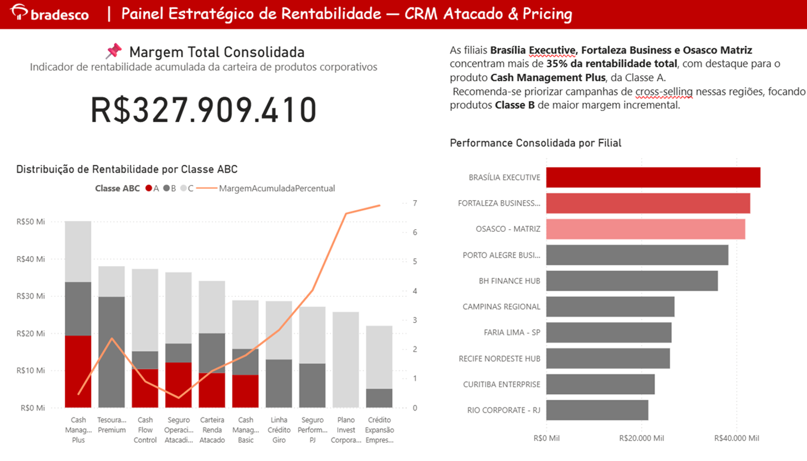

# Case Bradesco – Pricing & Rentabilidade

## Objetivo
Desenvolver um painel estratégico de rentabilidade para o **CRM Atacado do Bradesco**, com foco em priorização de produtos e filiais através da **Curva ABC** e análise de **margem consolidada**.

## Inteligência Aplicada
- Cálculo de **Margem Total** e **Percentual Acumulado**
- Classificação automática **A/B/C** de produtos
- **Ranking de Filiais** com destaque dinâmico (Top 3)
- Insight executivo com recomendação de **ações comerciais**
- Layout no padrão visual **institucional Bradesco**

## Visual do Painel

## Insight Executivo
As filiais **Brasília Executive, Fortaleza Business e Osasco Matriz** concentram mais de **35% da rentabilidade total**, com destaque para o produto **Cash Management Plus**, da Classe A.  
Recomenda-se priorizar campanhas de **cross-selling** nessas regiões, focando produtos **Classe B** de maior margem incremental.

## Curva ABC Explicada
A Curva ABC é uma técnica que **classifica produtos ou clientes segundo sua contribuição para o resultado total**, permitindo identificar os itens mais relevantes para o negócio.

| Classe | Descrição | % da Rentabilidade | Exemplo |
|:-------:|:-----------|:------------------|:--------|
| A | Itens estratégicos de alta rentabilidade | ~70% | Cash Management Plus |
| B | Itens intermediários com potencial de crescimento | ~20% | Linha Crédito Giro |
| C | Itens de baixa representatividade | ~10% | Crédito Expansão Empresarial |

## Performance por Filiais
O painel destaca o **ranking das filiais com maior contribuição de margem** no portfólio de CRM Atacado.  
A análise evidencia os **centros de rentabilidade** e as **regiões prioritárias para expansão comercial**.

| Grupo | Interpretação |
|:------|:--------------|
| Top 3 – Brasília, Fortaleza, Osasco | Alto desempenho, mais de 35% da margem total. |
| Intermediário – Porto Alegre, BH, Campinas | Bom volume, mas com margem menor por cliente. |
| Demais Filiais | Baixo impacto direto, com potencial de crescimento regional. |

## Apresentação Completa (PDF)
[Baixar o Case em PDF](Case_Bradesco_Rentabilidade.pdf)

## Ferramentas
Power BI • DAX • Python (para simulação de dataset) • Excel • GitHub

## Resultado
Painel de **rentabilidade corporativa** com narrativa executiva e design orientado à decisão, simulando padrões de **dashboards bancários reais**.
